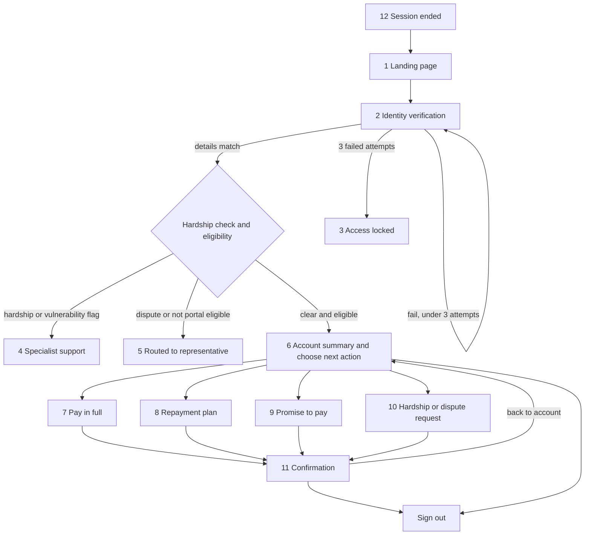

# Smart-Recovery Portal Prototype: Screens

Phase 1 self-service portal for Legacy Trust Bank. Screens follow `docs/to-be_workflow.bpmn`, and story IDs refer to the Jira backlog (`submissions/Jira (1).csv`).

## Run it

Open `static/index.html` in a browser (double-click it, or run `open static/index.html`). No server or install is needed: the rules and demo data run in the browser through `static/mock-api.js`.

- Click a customer on the landing page and the verification fields are pre-filled, for example Naomi Clarke. Change a field to show a failed attempt.
- Reloading `index.html` starts a fresh demo.
- `static/staff.html` shows the database, representative queue and audit log. It reads the same browser storage, so open it in the same browser as the portal.
- `server.py` is the earlier backend version and is not needed for the prototype.

## Screen list

| # | Screen | Purpose | Stories | Next step |
|---|---|---|---|---|
| 1 | Landing page | Entry point from the customer's portal link. In the prototype, you pick a demo customer here. | KAN-22 | Identity verification, or the locked screen if access is locked |
| 2 | Identity verification | Customer enters date of birth, post code and last 4 card digits. No account data is shown. | KAN-11 | Hardship check (hidden), then a result screen. After 3 failures, the locked screen. |
| 3 | Access locked | Tells the customer access is locked for 60 minutes and shows the support number. | KAN-14 | End of journey. The case goes to the representative queue. |
| 4 | Specialist support (hardship or vulnerability flag) | Hides all payment options and shows the specialist contact message. | KAN-16, KAN-23 | End of journey |
| 5 | Routed to representative (unsupported case) | Shown when the account is not portal eligible or has an open dispute. | KAN-22, KAN-23 | End of journey |
| 6 | Account summary and choose next action | Shows overdue balance, product, days overdue, total balance and status. It also offers the four options below. | KAN-12 | Pay in full, repayment plan, promise to pay, or hardship and dispute help |
| 7 | Pay in full | Card payment of the full overdue balance. | KAN-20 | Confirmation, or an error message on this screen |
| 8 | Repayment plan | Choose 3, 6 or 12 months, preview instalments, pay the first instalment. | KAN-18 | Confirmation |
| 9 | Promise to pay | Choose a date (tomorrow to 30 days ahead) and an amount. | KAN-19 | Confirmation |
| 10 | Hardship or dispute request | Three-question form. Online options stop for the account. | KAN-21, KAN-23 | Confirmation (no return to the account summary) |
| 11 | Confirmation or next steps (on-screen receipt) | Reference number, amounts and dates. No email is sent. | KAN-20, KAN-18, KAN-19, KAN-21 | Back to account summary, or sign out |
| 12 | Session ended | Shown after 5 minutes of inactivity. | KAN-15 | Back to the landing page |

The inactivity warning is a modal over any signed-in screen. It appears at 4 minutes and asks the customer to stay signed in.

## How the screens connect

## Rules behind the routing

Portal eligibility is decided before the customer arrives (KAN-22). An account is eligible only when all four hold:

1. No hardship or vulnerability flag.
2. No active dispute.
3. Overdue balance is below 5,000 GBP.
4. Days overdue is below 60.

Any other account is sent to the representative queue with the reason recorded. The checks in screens 4 and 5 run again after verification, so a flag added later still diverts the customer.

## Notes

- Screen 6 combines "Account summary" and "Choose next action" because the options sit beneath the balance on one page.
- Plan and promise options are hidden or disabled once a plan or promise is active. Pay in full stays available while a balance is owed.
- Every screen change that writes data updates the legacy database simulation before the confirmation appears, and is added to the audit log (KAN-25, KAN-26).
- Out of Phase 1: email confirmations, Direct Debit, legal escalation, and transaction history.
