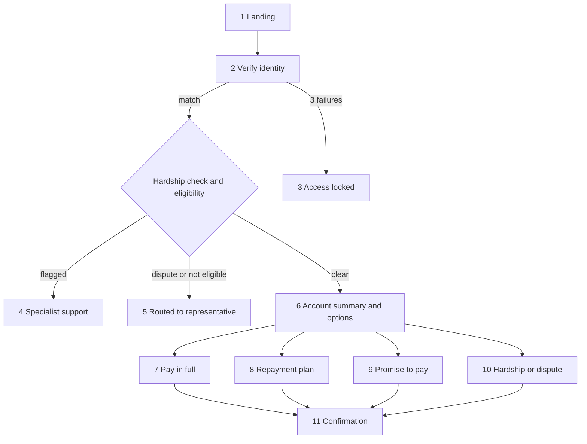

# Smart-Recovery Wireframe and Prototype

Clickable prototype of the Phase 1 self-service portal for Legacy Trust Bank. It runs in a browser from plain HTML, CSS and JavaScript. It has no server, and it uses demo data only.

## Open the prototype

- Customer portal: [smart-recovery-portal-prototype/static/index.html](smart-recovery-portal-prototype/static/index.html)
- Staff, queue and audit view: [smart-recovery-portal-prototype/static/staff.html](smart-recovery-portal-prototype/static/staff.html)

Double-click `index.html`, or run `open smart-recovery-portal-prototype/static/index.html` from this folder. Open the staff view in the same browser. Reloading `index.html` starts a fresh demo.

Screen-by-screen notes, a flow diagram and the routing rules are in [smart-recovery-portal-prototype/README.md](smart-recovery-portal-prototype/README.md). The same notes sit as comments above each screen in `index.html`.

## Screens

| # | Screen | Related stories | Key data shown | Rule | Next step |
|---|---|---|---|---|---|
| 1 | Landing page | KAN-22 | Demo customer list | Link must be valid | Identity verification |
| 2 | Identity verification | KAN-11, KAN-26 | Date of birth, post code, last 4 card digits | All three must match; error never names the wrong field | Account summary, a support screen, or Access locked |
| 3 | Access locked | KAN-14, KAN-23 | Support number, time access reopens | 3 failed attempts lock access for 60 minutes | End; case goes to the representative queue |
| 4 | Specialist support | KAN-16, KAN-23 | Support message and number | Hardship or vulnerability flag hides all payment options | End |
| 5 | Routed to representative | KAN-22, KAN-23 | Support number | Open dispute, balance 5,000 or more, or 60+ days overdue | End |
| 6 | Account summary and choose next action | KAN-12 | Overdue balance, product, days overdue, total balance, status | Plan and promise hidden while one is active | Pay, plan, promise to pay, or help |
| 7 | Pay in full | KAN-20, KAN-25 | Full amount, card form | Full balance only; decline leaves balance unchanged | Confirmation |
| 8 | Repayment plan | KAN-18, KAN-25 | 3, 6 or 12 month schedule, first instalment | Equal instalments; no plan if first payment fails | Confirmation |
| 9 | Promise to pay | KAN-19, KAN-25, KAN-29 | Date and amount | Tomorrow to 30 days ahead; amount up to the balance | Confirmation |
| 10 | Hardship or dispute request | KAN-21, KAN-23 | Three-question form | All answers required; ends self-service | Confirmation |
| 11 | Confirmation (on-screen receipt) | KAN-18, KAN-19, KAN-20, KAN-21 | Reference, amount, dates, remaining balance | Shown only after the database write; no email sent | Account summary or sign out |
| 12 | Session ended | KAN-15 | None | 5 minutes of inactivity ends the session; warning at 4 minutes | Landing page |

## Exception paths included

| Exception | How to see it | Outcome |
|---|---|---|
| Failed verification and lockout | Pick Naomi Clarke, change a field, submit 3 times | Screen 3, case routed to the representative queue |
| Hardship flag | Pick Daniel Wright | Screen 4, no payment options |
| Open dispute | Pick Fiona Bell | Screen 5 |
| Balance of 5,000 or more | Pick Omar Hassan | Screen 5 |
| 60 or more days overdue | Pick Priya Nair | Screen 5 |
| Vulnerability flag | Pick Amara Okafor | Screen 4 |
| Card declined or payment service error | On a pay screen, use card `4000 0000 0000 0002` or `4000 0000 0000 0119` | Error message on screen 7 or 8, balance unchanged |
| Customer asks for help | Pick Naomi Clarke, choose Hardship or dispute | Screen 10, then confirmation; case appears in the staff view |
| Unpaid promise | Record a promise, then use the button in the staff view | Case routed to the representative queue |

## Traceability: pain point to story to screen

| Pain point (source) | Opportunity | Story | Screen |
|---|---|---|---|
| Status updates re-keyed across spreadsheets and the database cause errors and unreliable reporting (OPT-04, SN-096) | Automated case update | KAN-25 write-back, KAN-26 audit trail | 7, 8, 9, 11: confirmation appears only after the database write; staff view shows the record and audit entry |
| Customers do not know what they owe and phone for balance checks (OPT-02) | Self-service repayment | KAN-12 | 6 |
| Simple cases wait behind complex ones with no priority logic (OPT-01) | Automated account triage | KAN-22, KAN-23 | 1, 5 |
| Follow-ups and promises lapse without enforcement (OPT-03, FA-06) | Promise monitoring | KAN-19, KAN-29 | 9; staff view |
| Vulnerable customers risk being handled as simple cases (ADKAR risk) | Hardship diversion | KAN-16, KAN-21 | 4, 10 |

## Demo script for stakeholders

1. Open `index.html` and click **Naomi Clarke**. The verification fields are pre-filled, so press Continue.
2. On the summary (screen 6), choose **Set up a repayment plan**, pick 6 months, and confirm. The test card is pre-filled.
3. Open the staff view and show the status change and audit entries.
4. Return and sign out, then click **Daniel Wright** to show the hardship exception.

## Status and limits

- Demo data only; no real payments, emails or customer data.
- Not yet usability tested with representatives or customers.
- Out of Phase 1 scope and not built: confirmation and reminder emails, Direct Debit, legal escalation.
